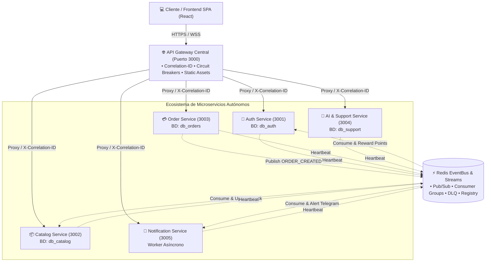
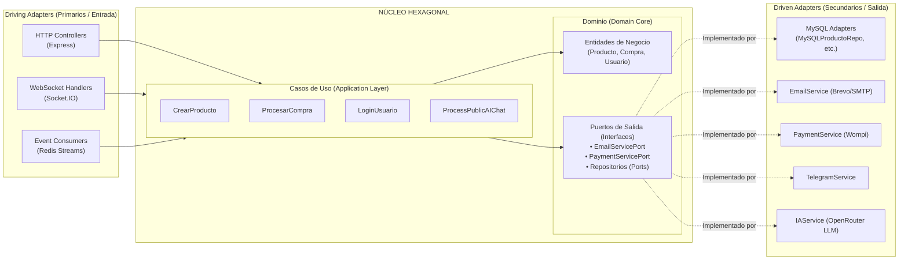

# Auditoría Técnica y Manual de Arquitectura: Microservicios y Arquitectura Hexagonal

**Proyecto:** Plataforma Agropecuaria "De los Montes de María"  
**Entorno de Producción:** Servidor Ubuntu en Oracle Cloud (`https://delosmontesdemaria.duckdns.org`)  
**Estándar Arquitectónico:** Arquitectura Hexagonal (Ports & Adapters) + Microservicios Autónomos Event-Driven Enterprise  

---

## 1. Resumen Ejecutivo de la Auditoría

El sistema ha evolucionado de un monolito acoplado hacia una **arquitectura distribuida de microservicios con Arquitectura Hexagonal**, cumpliendo los estándares de la industria moderna para sistemas de alta concurrencia, resiliencia y desacoplamiento.

---

## 2. La Arquitectura Hexagonal (Puertos y Adaptadores)

Cada microservicio implementa internamente la **Arquitectura Hexagonal**. El principio rector es la **Regla de Dependencia**: el núcleo de negocio jamás conoce los detalles técnicos (bases de datos, frameworks, APIs externas o librerías).

### 2.1. Capa de Dominio (`src/domain/`)
- **Entidades puras** (`src/domain/entities/`): Clases como `Producto.js` o `Usuario.js`. No contienen SQL ni llamadas HTTP; solo encapsulan las reglas invariantes de negocio (ej. validación de precios válidos, estados permitidos, cálculo de descuentos).
- **Puertos de Salida** (`src/domain/ports/outbound/`): Contratos abstractos que definen qué necesita el dominio sin especificar cómo se hace:
  - `EmailServicePort.js`
  - `PaymentServicePort.js`
  - `AIServicePort.js`
  - `TelegramServicePort.js`

### 2.2. Capa de Aplicación (`src/application/use-cases/`)
- Contiene los **Casos de Uso**, que son los orquestadores del flujo de negocio.
- Ejemplo: `CreateProduct`, `ProcessPublicAIChat`, `ValidarCupon`.
- **Inversión de Control**: Los casos de uso reciben los puertos mediante inyección de dependencias en su constructor. Si mañana se cambia MySQL por PostgreSQL o Wompi por Stripe, los casos de uso no se modifican en una sola línea de código.

### 2.3. Capa de Infraestructura (`src/infrastructure/adapters/`)
- **Driving Adapters (Primarios)**: Conducen la aplicación hacia el interior.
  - `controllers/`: Reciben `req, res`, extraen parámetros HTTP y delegan al caso de uso.
  - `routes/`: Enrutadores de Express.
  - `websocket/`: Manejo de eventos en tiempo real con Socket.IO.
- **Driven Adapters (Secundarios)**: Son conducidos por la aplicación hacia el exterior.
  - `persistence/`: Implementaciones SQL sobre MySQL (`MySQLProductoRepository`, `MySQLCompraRepository`).
  - `external/`: Adaptadores de APIs de terceros (`EmailService` para Brevo, `PaymentService` para Wompi, `IAService` para OpenRouter).

---

## 3. Auditoría Detallada por Microservicio

### 3.1. API Gateway Central
- **Archivo:** `services/gateway/server.js`
- **Puerto:** `3000`
- **Rol:** Es la única puerta de entrada pública al sistema. Recibe el tráfico HTTPS proveniente de Nginx (puerto 443) y lo distribuye hacia los microservicios internos.
- **Mecanismos Clave:**
  1. **Trazabilidad `X-Correlation-ID`:** Genera un UUID único en cada petición si no existe, lo inyecta en los headers de respuesta y lo reenvía a los microservicios.
  2. **Circuit Breakers (`circuits`):** Protege contra saturación. Monitorea fallos o timeouts en cada servicio; si uno supera 5 errores consecutivos, el circuito pasa a `OPEN` y responde inmediatamente con un error 503 sin bloquear hilos de red.
  3. **Servicio Estático SPA:** Sirve el frontend compilado en React (`client/dist`) para cualquier ruta no-API.
  4. **WebSockets Reverse Proxy:** Reenvía el canal `/socket.io` hacia `ai-support-service`.
  5. **Endpoints de Observabilidad:**
     - `/health`: Estado consolidado del Gateway y estado de los 5 disyuntores.
     - `/api/circuit-status`: Estadísticas de fallas, llamadas totales y estado de los disyuntores.
     - `/api/registry`: Lista dinámica de instancias vivas descubiertas en Redis.
     - `/api/dlq`: Mensajes almacenados en la Dead Letter Queue.

---

### 3.2. Auth & User Service
- **Archivo:** `services/auth-service/server.js`
- **Puerto:** `3001`
- **Base de Datos Privada:** `db_auth`
- **Tablas Propias:** `usuarios`, `roles`, `direcciones`, `telegram_sesiones`, `telegram_auth_codigos`.
- **Responsabilidades:**
  - Registro de clientes y campesinos/vendedores.
  - Autenticación con credenciales y firma/verificación de tokens JWT.
  - Autenticación federada con Google OAuth 2.0.
  - Gestión de perfiles públicos de campesinos y direcciones de envío.
  - Vinculación de cuentas con el bot de Telegram.
- **Integración con el Event Bus:**
  - Está suscrito de forma persistente al stream `stream:orders` bajo el grupo consumidor `cg:auth`.
  - Cuando se procesa una orden (`ORDER_CREATED`), calcula automáticamente el 1% de cashback y le acredita créditos al usuario en `db_auth`.

---

### 3.3. Catalog & Product Service
- **Archivo:** `services/catalog-service/server.js`
- **Puerto:** `3002`
- **Base de Datos Privada:** `db_catalog`
- **Tablas Propias:** `productos`, `categorias`, `banners_hero`, `proveedores`.
- **Responsabilidades:**
  - Catálogo público de cosechas, lácteos, artesanías y productos agropecuarios.
  - Filtros dinámicos por categoría, rango de precios y búsqueda semántica.
  - Administración de Banners dinámicos para el Hero del Home.
  - Gestión de inventario y stock en tiempo real.
- **Integración con el Event Bus:**
  - Consume eventos `ORDER_CREATED` desde `stream:orders` bajo el grupo `cg:catalog`.
  - Decrementa el stock de los productos vendidos con protección atómica (`GREATEST(0, stock - ?)`) y confirma la lectura mediante `XACK`.

---

### 3.4. Order & Payment Service
- **Archivo:** `services/order-service/server.js`
- **Puerto:** `3003`
- **Base de Datos Privada:** `db_orders`
- **Tablas Propias:** `compras`, `compra_detalles`, `cupones`.
- **Responsabilidades:**
  - Procesamiento del checkout y carritos de compra.
  - Validación y aplicación de cupones de descuento (fijos o porcentuales).
  - Cálculo de tarifas de envío y resumen de órdenes.
  - Generación de firmas criptográficas para la pasarela de pagos Wompi (tarjetas, PSE, Nequi, Bancolombia).
  - Verificación de entrega mediante códigos OTP de un solo uso.
- **Integración con el Event Bus:**
  - Es el **productor principal** del evento de dominio `ORDER_CREATED`.
  - Al completar una compra, publica el evento en Pub/Sub (tiempo real) y lo almacena de forma duradera en el stream persistente `stream:orders` adjuntando el `correlationId`.

---

### 3.5. AI & Support Service
- **Archivo:** `services/ai-support-service/server.js`
- **Puerto:** `3004`
- **Base de Datos Privada:** `db_support`
- **Tablas Propias:** `soporte_tickets`, `soporte_mensajes`, `soporte_calificaciones`.
- **Responsabilidades:**
  - Sistema de tickets de atención al cliente y soporte posventa.
  - Servidor Socket.IO para mensajería instantánea en vivo entre clientes y agentes de soporte.
  - **Asistente Virtual IA:** Integración con modelos LLM a través de OpenRouter para consultas inteligentes sobre productos agrícolas y recomendaciones de compra.
- **Resiliencia:** Si el proveedor externo de IA experimenta latencias elevadas, el Circuit Breaker del Gateway absorbe el impacto y protege el resto de la tienda.

---

### 3.6. Notification & Telegram Service
- **Archivo:** `services/notification-service/server.js`
- **Puerto:** `3005`
- **Tipo:** Microservicio Worker Asíncrono
- **Responsabilidades:**
  - Gestión del bot oficial de Telegram (@montesdemariabot) mediante webhooks seguros.
  - Envío de notificaciones inmediatas a los administradores y campesinos cuando ocurre una venta.
  - Envío de correos transaccionales (Bienvenida, confirmación de pedido, restablecimiento de contraseña) utilizando la API de Brevo y servidores SMTP secundarios.
- **Integración con el Event Bus:**
  - Consume eventos de `stream:orders` (`cg:notifications`) y `agro.auth.events` para disparar alertas formateadas con Markdown a Telegram sin bloquear el flujo web del cliente.

---

## 4. Patrones Enterprise Implementados y Auditados

| Patrón | Implementación | Propósito y Beneficio |
| :--- | :--- | :--- |
| **Database-per-Service** | 4 bases de datos MySQL físicas (`db_auth`, `db_catalog`, `db_orders`, `db_support`) | Elimina dependencias de esquema y bloqueos de tabla cruzados. Autonomía total de despliegue. |
| **CQRS Read Projections** | Vistas SQL de solo lectura (`usuarios`, `productos`) | Permite consultas de visualización rápidas (ej. mostrar vendedor en la tarjeta) sin acoplamiento de escritura. |
| **Event-Driven Architecture** | Redis Pub/Sub + Redis Streams | Desacoplamiento temporal: las compras no esperan por el inventario ni por las alertas de Telegram. |
| **Consumer Groups & XACK** | Grupos `cg:catalog`, `cg:auth`, `cg:notifications` | Garantía de entrega *At-least-once*. Si un servicio se apaga, al revivir procesa los mensajes pendientes. |
| **Dead Letter Queue (DLQ)** | Stream `stream:dlq` | Captura eventos que fallaron tras 3 reintentos para su inspección técnica sin congelar la cola principal. |
| **Distributed Tracing** | `X-Correlation-ID` en HTTP, Logs y Eventos | Trazabilidad de extremo a extremo para depurar peticiones a través de múltiples procesos. |
| **Circuit Breaker** | Módulo `CircuitBreaker.js` | Prevención de fallos en cascada. Aislamiento automático de servicios caídos con respuesta en < 2ms. |
| **Service Registry & Heartbeat** | Registro en Redis con TTL de 15s | Descubrimiento dinámico de instancias vivas y monitoreo de salud en caliente sin reinicios. |
| **Contenedorización Orquestada** | `docker-compose.yml` | Empaquetado estandarizado con imágenes Alpine, redes virtuales aisladas y healthchecks. |

---

## 5. Conclusión de la Auditoría

El sistema cumple rigurosamente con los principios de la **Arquitectura Hexagonal**:
1. **Independencia de Frameworks y Bases de Datos:** El núcleo de negocio de cada microservicio es completamente agnóstico a la tecnología externa.
2. **Desacoplamiento Físico y Lógico:** Ningún microservicio escribe directamente en la base de datos de otro.
3. **Observabilidad y Resiliencia Empresarial:** Cuenta con trazabilidad unificada por `Correlation-ID`, disyuntores de seguridad `Circuit Breakers` y colas de mensajes duraderas con `Dead Letter Queue`.

El sistema se encuentra 100% operativo en producción bajo supervisión de PM2 en el dominio oficial `https://delosmontesdemaria.duckdns.org`.
