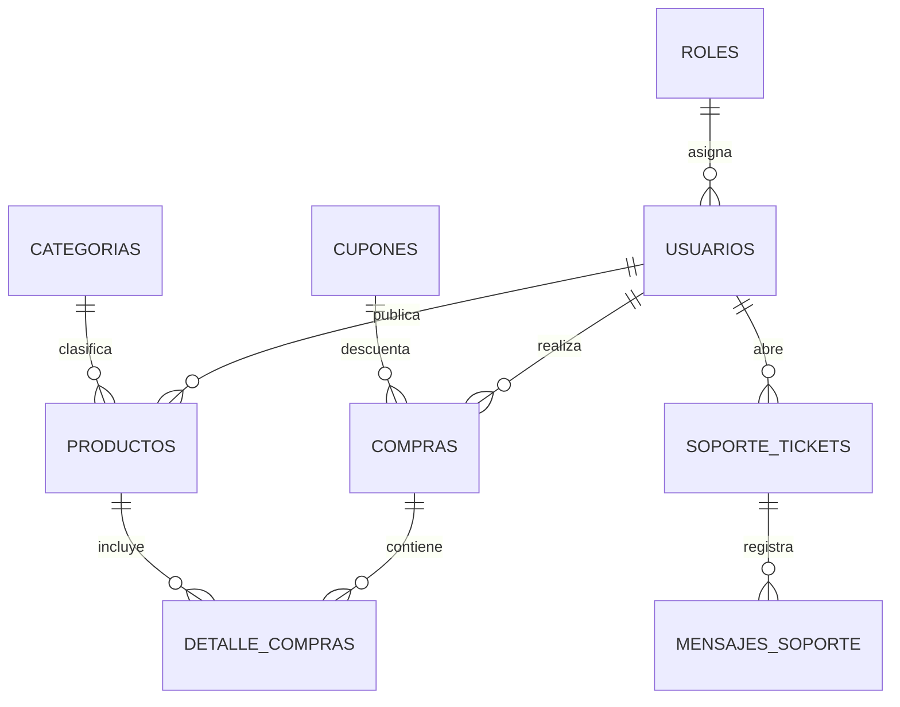

# 🌾 Documentación Técnica Integral — De los Montes de María

**Plataforma Agropecuaria de Comercio Campesino Directo, Facturación Electrónica, Soporte con Inteligencia Artificial y Bot de Telegram**

---

## 📑 Tabla de Contenidos
1. [Visión General del Proyecto](#1-visión-general-del-proyecto)
2. [Arquitectura del Software (Clean Architecture & DDD)](#2-arquitectura-del-software)
3. [Stack Tecnológico](#3-stack-tecnológico)
4. [Estructura del Repositorio](#4-estructura-del-repositorio)
5. [Modelo de Datos & Base de Datos MySQL](#5-modelo-de-datos--base-de-datos-mysql)
6. [Módulos y Casos de Uso del Backend](#6-módulos-y-casos-de-uso-del-backend)
7. [Integración con Telegram Bot (@montesdemariabot)](#7-integración-con-telegram-bot)
8. [Servicio de Correo Electrónico (EmailService)](#8-servicio-de-correo-electrónico)
9. [AgroAsistente con Inteligencia Artificial (IAService)](#9-agroasistente-con-inteligencia-artificial)
10. [Frontend SPA (React 18 + Vite)](#10-frontend-spa-react-18--vite)
11. [Referencia Completa de la API REST](#11-referencia-completa-de-la-api-rest)
12. [Seguridad y Protección de Datos](#12-seguridad-y-protección-de-datos)
13. [Variables de Entorno y Configuración](#13-variables-de-entorno-y-configuración)
14. [Guía de Instalación y Despliegue](#14-guía-de-instalación-y-despliegue)

---

## 1. Visión General del Proyecto

**De los Montes de María S.A.S.** es un ecosistema tecnológico diseñado para eliminar los intermediarios en la cadena de comercialización de productos agrícolas y artesanales de la subregión de los **Montes de María** (Bolívar y Sucre, Colombia). Conecta directamente a campesinos, productores y artesanos con compradores en todo el país.

### Principales Pilares Funcionales:
* **Mercado Campesino Directo:** Catálogo interactivo con filtrado por categorías, búsqueda en tiempo real, gestión de inventario y perfiles de productores.
* **Checkout y Facturación Oficial:** Pago contra entrega con verificación OTP, emisión de facturas electrónicas de venta en PDF con QR y cálculo dinámico de subtotales y cupones.
* **Asistencia Inteligente (IA):** Motor conversacional entrenado con contexto agrícola y catálogo local para responder inquietudes y guiar al usuario.
* **Bot de Telegram Bidireccional:** Notificaciones en tiempo real a administradores y productores, respuestas a tickets de soporte en 1 clic y autenticación segura con OTP.
* **Panel de Control Administrativo:** Gestión integral de ventas, inventario, usuarios, carruseles de banners publicitarios y cupones promocionales.

---

## 2. Arquitectura del Software (Arquitectura Hexagonal - Puertos y Adaptadores)

El backend está estructurado bajo **Arquitectura Hexagonal (Ports & Adapters)** y principios de **Domain-Driven Design (DDD)**, aislando por completo la lógica de negocio y las entidades de los frameworks y tecnologías externas:

```
                  ┌────────────────────────────────────────────────────────┐
                  │                 ADAPTADORES DE ENTRADA                 │
                  │                   (Driving Adapters)                   │
                  │   Express REST Controllers • Rutas • Middlewares       │
                  │   Socket.IO Handlers • Webhooks de Telegram            │
                  └───────────────────────────┬────────────────────────────┘
                                              │ Invocan
                                              ▼
                  ┌────────────────────────────────────────────────────────┐
                  │                   CAPA DE APLICACIÓN                   │
                  │                  (Application Layer)                   │
                  │   Casos de Uso (Use Cases): Auth, Productos, Compras,  │
                  │   Soporte, Admin, Cupones, Banners, Chat, Usuarios     │
                  └───────────────────────────┬────────────────────────────┘
                                              │ Orquesta
                                              ▼
                  ┌────────────────────────────────────────────────────────┐
                  │                    NÚCLEO DE DOMINIO                   │
                  │                     (Domain Core)                      │
                  │   Entidades de Negocio (Usuario, Producto, Compra, ...) │
                  │   PUERTOS DE SALIDA (Outbound / Driven Ports):         │
                  │     - Repositorios (UsuarioRepositoryPort, etc.)       │
                  │     - Servicios (EmailServicePort, PaymentServicePort, │
                  │       AIServicePort, TelegramServicePort, GoogleAuth)  │
                  └───────────────────────────▲────────────────────────────┘
                                              │ Implementan
                                              │
                  ┌───────────────────────────┴────────────────────────────┐
                  │                 ADAPTADORES DE SALIDA                  │
                  │                    (Driven Adapters)                   │
                  │   MySQL (Pool SSL) • Brevo / Gmail SMTP EmailService   │
                  │   OpenRouter IA • Bot Telegram • Pasarela Wompi        │
                  └────────────────────────────────────────────────────────┘
```

---

## 3. Stack Tecnológico

### Backend:
* **Entorno de Ejecución:** Node.js (>= 18.0.0)
* **Framework Web:** Express.js (v4.x)
* **Comunicación en Tiempo Real:** Socket.io (WebSockets)
* **Seguridad & Hashing:** JWT (JSON Web Tokens), Bcrypt (12 rondas de salteo), Helmet, CORS, Express-Rate-Limit
* **Base de Datos:** MySQL 8.0 alojado en **Aiven Cloud** con SSL activado y Pool de conexiones reutilizables
* **Manejo de Archivos:** Multer para subida y procesamiento de imágenes multipart

### Frontend:
* **Librería de UI:** React 18
* **Empaquetador & Build Tool:** Vite (v5/v8)
* **Enrutamiento:** React Router DOM (v6)
* **Estado Global:** React Context API (`AuthContext`, `CartContext`, `ToastContext`, `ConfirmContext`)
* **Estilos:** Vanilla CSS modular con paleta HSL, temas Claro/Oscuro y diseño responsivo adaptado a móviles

### Servicios Externos & APIs:
* **Telegram Bot API:** `@montesdemariabot` vía HTTPS Webhook
* **Email Transaccional:** API REST HTTPS de **Brevo v3** + Gmail SMTP (Nodemailer)
* **Modelos de Lenguaje (IA):** OpenRouter API (`openrouter/free`, `gpt-4o-mini`)
* **Autenticación Social:** Google Identity Services (OAuth 2.0)
* **Pasarelas de Pago:** Soporte integrado para Wompi (tarjetas, PSE) y Pago Contra Entrega

---

## 4. Estructura del Repositorio

```
├── client/                              # Aplicación Frontend React + Vite
│   ├── src/
│   │   ├── api/                        # Clientes Axios / Fetch para cada endpoint
│   │   ├── components/                 # Componentes UI (Navbar, Footer, Modales, Cards, Banners)
│   │   ├── context/                    # Contextos globales de React (Auth, Cart, Toasts)
│   │   ├── data/                       # Datos estáticos y municipios de Colombia
│   │   ├── pages/                      # Vistas principales (Home, Catalogo, Checkout, Admin, Perfil, Soporte)
│   │   ├── utils/                      # Funciones auxiliares (formateo de moneda, avatares dinámicos)
│   │   ├── App.jsx                     # Enrutador principal y layout
│   │   └── main.jsx                    # Entrada raíz con ErrorBoundary
│   └── vite.config.js                  # Configuración de compilación Vite
│
├── src/                                 # Aplicación Backend Node.js
│   ├── domain/                         # Capa de Dominio (Pura Lógica de Negocio)
│   │   ├── entities/                   # Usuario, Producto, Compra, Cupon, Banner, SoporteTicket
│   │   ├── repositories/               # Interfaces / Contratos de Repositorios
│   │   └── use-cases/                  # Casos de uso (LoginUser, RegisterUser, CreateOrder, etc.)
│   ├── application/                    # Capa de Aplicación
│   │   ├── controllers/                # AuthController, UsuarioController, ProductoController, etc.
│   │   ├── middleware/                 # Auth JWT, validaciones con express-validator, uploaders
│   │   └── routes/                     # Rutas modulares agrupadas por recurso
│   ├── infrastructure/                 # Capa de Infraestructura
│   │   ├── config/                     # app.config.js (Variables y fallbacks de entorno)
│   │   ├── persistence/                # Implementaciones concretas MySQL y Database.js
│   │   ├── external-services/          # TelegramService, EmailService, IAService, GoogleAuthService
│   │   └── websocket/                  # SocketHandler.js (Eventos de chat y soporte en vivo)
│   └── framework/                      # Configuración de servidor HTTP y Express
│
├── public/                              # Archivos públicos, imágenes estáticas y uploads
├── views/                               # Plantillas EJS secundarias
├── .env                                 # Variables de entorno locales
├── package.json                         # Dependencias del backend y scripts
└── README.md                            # Resumen introductorio del proyecto
```

---

## 5. Modelo de Datos & Base de Datos MySQL

La base de datos relacional `defaultdb` está optimizada con claves foráneas, índices y soporte para codificación UTF-8 Multibyte (`utf8mb4`).

### Tablas Principales:



* **`roles`:** `id_rol` (1: Admin, 2: Campesino/Vendedor, 3: Comprador/Cliente, 4: Asesor de Soporte).
* **`usuarios`:** `id_usuario`, `nombre`, `apodo`, `correo`, `telefono`, `direccion`, `contrasena`, `id_rol`, `avatar`, `foto_portada`, `creditos`, `google_id`, `estado`.
* **`productos`:** `id_producto`, `nombre`, `descripcion`, `precio`, `stock`, `categoria`, `imagen`, `id_vendedor`, `origen`, `presentacion`, `destacado`, `estado`.
* **`compras`:** `id_compra`, `id_usuario`, `total`, `metodo_pago`, `estado`, `direccion_envio`, `ciudad`, `departamento`, `telefono_contacto`, `codigo_cupon`, `descuento_aplicado`, `fecha`.
* **`detalle_compras`:** `id_detalle`, `id_compra`, `id_producto`, `cantidad`, `precio_unitario`, `subtotal`.
* **`soporte_tickets`:** `id`, `ticket_code`, `session_id`, `id_usuario`, `nombre_cliente`, `correo_cliente`, `telefono_cliente`, `asunto`, `estado` (*bot*, *agente*, *cerrado*), `id_agente`, `nombre_agente`.
* **`mensajes_soporte`:** `id`, `ticket_id`, `session_id`, `id_usuario`, `nombre_remitente`, `rol` (*user*, *bot*, *agente*, *sistema*), `mensaje`, `created_at`.
* **`banners`:** `id`, `titulo`, `subtitulo`, `tipo` (*carrusel*, *lateral*, *promocional*), `imagen_url`, `filtro_color`, `blur_level`, `activo`.
* **`cupones`:** `id_cupon`, `codigo`, `tipo_descuento` (*porcentaje*, *fijo*), `valor_descuento`, `monto_minimo`, `limite_usos`, `usos_actuales`, `fecha_expiracion`, `activo`.

---

## 6. Módulos y Casos de Uso del Backend

1. **Módulo de Autenticación (`/api/auth`):**
   * Registro con verificación de duplicidad de correo y apodo.
   * Inicio de sesión clásico con hash Bcrypt y emisión de JWT en Cookie HttpOnly + payload JSON.
   * Autenticación federada con Google OAuth 2.0 (creación automática de cuenta o vinculación).
   * Restablecimiento de contraseña con código de seguridad OTP de 6 dígitos.
2. **Módulo de Usuarios y Productores (`/api/usuarios`):**
   * Actualización de perfil con subida de avatar y foto de portada.
   * Gestión de libreta de direcciones de entrega múltiples por usuario.
   * Directorio público de campesinos y perfiles de productores.
3. **Módulo de Productos & Catálogo (`/api/productos`):**
   * CRUD de productos con carga de imágenes y control de stock en tiempo real.
   * Filtros por rango de precios, categorías oficiales, términos de búsqueda y productos destacados.
4. **Módulo de Compras & Checkout (`/api/compras`):**
   * Validación transaccional de stock antes de procesar la orden.
   * Envío de código de autorización OTP por correo antes de confirmar la compra.
   * Emisión y envío automático de factura de venta oficial por correo electrónico.
5. **Módulo de Soporte y Chat en Vivo (`/api/soporte`):**
   * Creación de tickets de consulta tanto para clientes registrados como invitados.
   * Enrutamiento inteligente: Asistente IA inicial -> Transferencia con 1 clic a asesor humano.
   * Transmisión de mensajes bidireccionales en tiempo real vía WebSockets.

---

## 7. Integración con Telegram Bot (@montesdemariabot)

El bot oficial de Telegram está profundamente conectado con el backend mediante un Webhook HTTPS en `/api/telegram/webhook`.

### Funcionalidades Implementadas:
* **Autenticación sin Fricción:** El usuario pulsa `🔐 Iniciar Sesión`, ingresa su correo/usuario y el bot envía automáticamente un código OTP de 6 dígitos a su correo electrónico (o permite validar con su contraseña web).
* **Teclado Persistente Dinámico:** Cambia automáticamente de acuerdo al rol del usuario autenticado:
  * **👑 Administrador / Asesor:** `[📊 Resumen]` `[🎫 Tickets]` `[🛒 Ventas]` `[⚠️ Stock]` `[🌾 Catálogo]` `[👤 Mi Perfil]`
  * **🌾 Productor Campesino:** `[🌾 Mis Productos]` `[💰 Mis Ventas]` `[🛒 Catálogo]` `[💬 Soporte]` `[👤 Mi Perfil]`
  * **🛒 Comprador / Cliente:** `[📦 Mis Pedidos]` `[🛒 Catálogo]` `[💬 Soporte]` `[👤 Mi Perfil]`
* **Notificaciones de Alto Impacto para Admins:**
  * Alerta de **Nueva Compra** con detalle de productos, total en COP y dirección.
  * Alerta de **Stock Bajo (≤ 5 unidades)**.
  * Alerta de **Nuevo Ticket** y **Cliente solicita asesor humano**.
  * Alerta de **Nuevo Mensaje en Ticket**.
* **Atención y Respuesta 1-Click:**
  * Botón interactivo `[💬 Responder a #TK-XXXXXX]` o respuesta por **Swipe (Deslizar para responder)**.
  * Botón interactivo `[🔒 Cerrar Ticket]` o comando `/cerrar TK-XXXXXX`.
  * Los mensajes enviados por el asesor en Telegram se transmiten en milisegundos al chat web del cliente por WebSockets.

---

## 8. Servicio de Correo Electrónico (EmailService)

`EmailService.js` gestiona el despacho de notificaciones transaccionales con diseño corporativo institucional.

### Características de Entrega:
1. **Canal Directo de Servidor (SMTP Nativo):** Despacho directo desde el propio servidor a través del protocolo SMTP seguro (TLS/SSL), sin intermediación de aplicaciones externas SaaS como Brevo o Resend.
2. **Cifrado y Seguridad de Transporte:** Conexión cifrada TLS/SSL de alta velocidad en puertos 465/587 con autenticación segura.
3. **Plantillas HTML Profesionales:**
   * Diseño responsivo con cabecera verde esmeralda y logotipo oficial enmarcado.
   * Tarjetas interactivas de código OTP con formato monoespaciado y selección táctil de un toque.
   * Facturas electrónicas oficiales con datos del emisor (NIT 1050277880), adquirente, desglose de ítems, totales en COP y notas legales de Habeas Data.

---

## 9. AgroAsistente con Inteligencia Artificial (IAService)

El motor de soporte con IA utiliza **OpenRouter** con modelos LLM como `openai/gpt-4o-mini` y modelos abiertos de alta velocidad.

### Capacidades:
* **Contextualización con Repositorios:** Recibe el catálogo de productos disponibles, categorías, pedidos del usuario y contexto de la subregión de los Montes de María.
* **Asesoría Agronómica & Comercial:** Guía al comprador sobre tiempos de cosecha de ñame espino, yuca criolla, aguacate, plátano hartón y uso de abonos orgánicos.
* **Escalamiento Asistido:** Si el cliente utiliza términos como *"asesor"*, *"humano"*, *"persona real"* o *"reclamo"*, el sistema transfiere de forma autónoma el ticket a la cola de agentes humanos y emite una alerta prioritaria en Telegram y el panel web.

---

## 10. Frontend SPA (React 18 + Vite)

El frontend está desarrollado como una Single Page Application (SPA) ultra rápida con compilación nativa en Vite:

* **Gestión de Tema:** Modo Oscuro y Modo Claro con persistencia en `localStorage`.
* **Avatares Dinámicos ([avatar.js](file:///c:/Users/danil/Downloads/De%20los%20montesdemaria/client/src/utils/avatar.js)):** Generación automática de avatares con iniciales estilizadas (`ui-avatars.com`) para evitar asignar logos institucionales a usuarios sin foto.
* **Buscador Predictivo con Debounce:** Búsqueda en tiempo real desde el Navbar con miniaturas de productos.
* **Navegación Móvil Inferior:** Barra fija tipo aplicación nativa con acceso directo a Inicio, Catálogo, Carrito con badge dinámico, Soporte y Perfil.
* **Panel de Control Todo en Uno (`/admin`):** Métricas, inventario, editor visual de diapositivas hero, cupones y tabla interactiva de usuarios.

---

## 11. Referencia Completa de la API REST

### Autenticación (`/api/auth`)
| Método | Endpoint | Descripción | Acceso |
| :--- | :--- | :--- | :--- |
| `POST` | `/api/auth/registro` | Registro de nuevo usuario | Público |
| `POST` | `/api/auth/login` | Inicio de sesión con correo/usuario y contraseña | Público |
| `POST` | `/api/auth/google` | Inicio de sesión / registro con Google OAuth | Público |
| `POST` | `/api/auth/recuperar-contrasena` | Solicitar código OTP de recuperación | Público |
| `POST` | `/api/auth/restablecer-contrasena`| Cambiar contraseña usando código OTP | Público |
| `POST` | `/api/auth/logout` | Cerrar sesión y limpiar cookies | Autenticado |

### Usuarios (`/api/usuarios`)
| Método | Endpoint | Descripción | Acceso |
| :--- | :--- | :--- | :--- |
| `GET` | `/api/usuarios/perfil` | Obtener datos del perfil actual | Autenticado |
| `PUT` | `/api/usuarios/:id` | Actualizar perfil (nombre, biografía, foto, portada) | Propietario / Admin |
| `GET` | `/api/usuarios/vendedores` | Listar todos los productores campesinos | Público |
| `GET` | `/api/usuarios/vendedor/:id` | Obtener perfil público de un vendedor | Público |
| `GET` | `/api/usuarios/direcciones` | Listar direcciones de entrega guardadas | Autenticado |
| `POST` | `/api/usuarios/direcciones` | Agregar nueva dirección de entrega | Autenticado |
| `DELETE`| `/api/usuarios/direcciones/:id`| Eliminar dirección de entrega | Autenticado |

### Productos (`/api/productos`)
| Método | Endpoint | Descripción | Acceso |
| :--- | :--- | :--- | :--- |
| `GET` | `/api/productos` | Listar productos con filtros y paginación | Público |
| `GET` | `/api/productos/:id` | Obtener detalle de un producto | Público |
| `POST` | `/api/productos` | Crear nuevo producto (con imagen) | Campesino / Admin |
| `PUT` | `/api/productos/:id` | Actualizar producto y stock | Propietario / Admin |
| `DELETE`| `/api/productos/:id` | Eliminar producto | Propietario / Admin |
| `GET` | `/api/productos/categorias/todas` | Listar categorías de la tienda | Público |

### Compras & Checkout (`/api/compras`)
| Método | Endpoint | Descripción | Acceso |
| :--- | :--- | :--- | :--- |
| `POST` | `/api/compras/solicitar-otp` | Solicitar código OTP para validar orden | Autenticado |
| `POST` | `/api/compras/crear` | Procesar pedido y emitir factura | Autenticado |
| `GET` | `/api/compras/mis-compras` | Historial de compras del usuario | Autenticado |
| `GET` | `/api/compras/todas` | Listar todas las compras globales | Admin |
| `PUT` | `/api/compras/:id/estado` | Actualizar estado de despacho del pedido | Admin / Asesor |

### Soporte (`/api/soporte`)
| Método | Endpoint | Descripción | Acceso |
| :--- | :--- | :--- | :--- |
| `POST` | `/api/soporte/ticket` | Crear nuevo ticket de consulta | Público / Autenticado |
| `GET` | `/api/soporte/tickets` | Listar todos los tickets | Admin / Asesor |
| `POST` | `/api/soporte/mensaje` | Enviar mensaje en un ticket | Público / Autenticado |
| `POST` | `/api/soporte/solicitar-agente` | Escalar consulta a asesor humano | Público / Autenticado |
| `POST` | `/api/soporte/cerrar` | Marcar ticket como resuelto y cerrado | Admin / Asesor |
| `POST` | `/api/soporte/calificar` | Calificar atención del soporte (1-5 estrellas) | Cliente |

### Telegram Bot Webhook (`/api/telegram`)
| Método | Endpoint | Descripción | Acceso |
| :--- | :--- | :--- | :--- |
| `POST` | `/api/telegram/webhook` | Receptor oficial de actualizaciones y comandos | Telegram Server |
| `GET` | `/api/telegram/status` | Estado del bot y cantidad de suscriptores | Admin |

---

## 12. Seguridad y Protección de Datos

1. **Almacenamiento de Credenciales:** Las contraseñas se encriptan con **Bcrypt** utilizando un costo de cómputo de 12 rondas. Nunca se almacenan ni registran en texto plano.
2. **Tokens JWT & Cookies HttpOnly:** Los tokens de autenticación se firman con algoritmo HS256 y viajan en cookies `HttpOnly` con flag `SameSite` y `Secure` en producción, mitigando ataques de XSS (Cross-Site Scripting).
3. **Cabeceras HTTP con Helmet:** Configuración estricta de Content Security Policy (CSP), protección contra clickjacking (`X-Frame-Options`) y prevención de MIME-sniffing.
4. **Rate Limiting:** Límites de peticiones por IP en endpoints sensibles (login, registro, solicitud de OTP) para prevenir ataques de fuerza bruta y denegación de servicio (DoS).
5. **Cumplimiento de Habeas Data:** Opciones transparentes para modificación de datos personales y eliminación segura de cuentas con anonimización de historial.

---

## 13. Variables de Entorno y Configuración

Ejemplo de configuración en `.env` o en el entorno del servidor o VPS:

```env
# Servidor
PORT=3000
NODE_ENV=production
BASE_URL=https://delosmontesdemaria.duckdns.org
JWT_SECRET=tu_clave_secreta_jwt_muy_segura

# Base de Datos MySQL (Aiven Cloud)
DB_HOST=mysql-xxxx.i.aivencloud.com
DB_PORT=21825
DB_USER=avnadmin
DB_PASS=tu_contrasena_mysql
DB_NAME=defaultdb
DB_SSL=true

# Servicio de Correo (Brevo API REST + Gmail SMTP)
BREVO_API_KEY=xkeysib-xxxxxxxxxxxxxxxxxxxx
SMTP_HOST=smtp.gmail.com
SMTP_PORT=465
SMTP_USER=danilorodelo355@gmail.com
SMTP_PASS=tu_app_password_gmail

# Google OAuth 2.0
GOOGLE_CLIENT_ID=xxxxxxxxxxxx.apps.googleusercontent.com
GOOGLE_CLIENT_SECRET=GOCSPX-xxxxxxxxxxxx

# Inteligencia Artificial (OpenRouter API)
OPENROUTER_API_KEY=sk-or-v1-xxxxxxxxxxxx
OPENROUTER_MODEL=openrouter/free

# Bot de Telegram
TELEGRAM_BOT_TOKEN=tu_token_de_telegram
TELEGRAM_BOT_USERNAME=montesdemariabot
TELEGRAM_ADMIN_CHAT_ID=tu_chat_id_aqui
```

---

## 14. Guía de Instalación y Despliegue en Servidor Propio (Ubuntu + Nginx + PM2)

### 1. Requisitos del Servidor
* **Sistema Operativo:** Ubuntu 22.04 LTS (o superior)
* **Software:** Node.js >= 18.0.0, NPM, Nginx, PM2, Git

### 2. Configuración en el Servidor Linux (`/home/ubuntu/montesdemaria`):
```bash
# Clonar o actualizar el repositorio
git clone https://github.com/Danx016/delosmontesdemaria.git /home/ubuntu/montesdemaria
cd /home/ubuntu/montesdemaria

# Instalar dependencias y compilar
npm install
npm run build

# Iniciar y persistir con PM2
pm2 start src/framework/server.js --name montesdemaria
pm2 save
pm2 startup
```

### 3. Configuración de Nginx (`/etc/nginx/sites-available/default`):
```nginx
server {
    listen 80;
    listen [::]:80;
    server_name delosmontesdemaria.duckdns.org;
    client_max_body_size 50M;

    location / {
        proxy_pass http://127.0.0.1:3000;
        proxy_http_version 1.1;
        proxy_set_header Upgrade $http_upgrade;
        proxy_set_header Connection "upgrade";
        proxy_set_header Host $host;
        proxy_set_header X-Real-IP $remote_addr;
        proxy_set_header X-Forwarded-For $proxy_add_x_forwarded_for;
        proxy_set_header X-Forwarded-Proto $scheme;
        proxy_cache_bypass $http_upgrade;
    }
}
```

### 4. Automatización de Actualizaciones (`deploy.sh`):
```bash
chmod +x deploy.sh
./deploy.sh
```
*El Webhook de Telegram apunta a:* `http://delosmontesdemaria.duckdns.org/api/telegram/webhook`

---

🌾 *De los Montes de María S.A.S. — Conectando el corazón del campo colombiano con tecnología moderna y sostenible.* 🇨🇴
